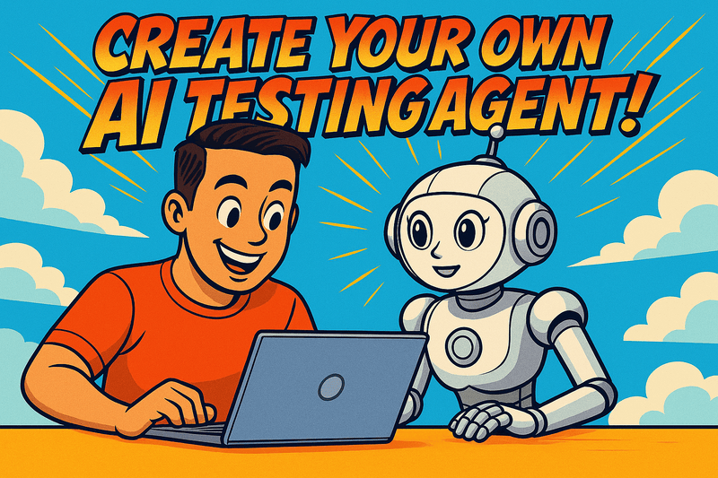

  

# Setup



- Create accounts for:
  - [GitHub](https://github.com)
  - [n8n](https://n8n.io/)
  - [Airtop](https://www.airtop.ai/)
  - [Vercel](https://vercel.com/)

- Clone repository:
  - https://github.com/tlolkema/ai-demo-webshop

- [Connect your Vercel account to the GitHub repository](https://vercel.com/docs/git#deploying-a-git-repository)
  - Within Vercel, top right click "Add New..."
  - Select the forked repository
  - import
  - Deploy

- Set your preview environments within Vercel to have no authorization.
  - Within Vercel click on "Settings"
  - Go to "Deployment Protection"
  - Switch off protection for the demo repository 

- [Import the workflow from the GitHub repository (within n8n directory) in n8n.](https://docs.n8n.io/courses/level-one/chapter-6/)
  - Use the "Import from File..." option

- Edit the n8n pipeline with all your own credentials to connect with GitHub, Airtop and OpenAI.

- Activate your workflow within n8n.
  - Switch the toggle at the top right to "Active"

# Workshop

- Vibe code a new feature, make sure to have a related GitHub issue.

- Create a PR to see if the workflow get executed correctly.

- Inspect the steps within the workflow execution to see what happened.

## Bonus

- Extend the workflow with logic based on the test results.

- Vibe code another feature of your choice and let it go through the workflow.

- Whatever you feel like extending the pipeline or agentic capabilities. 😃
